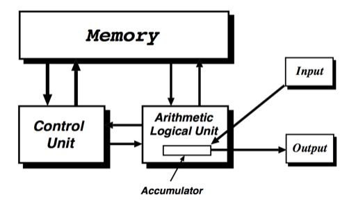
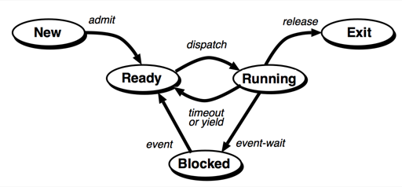
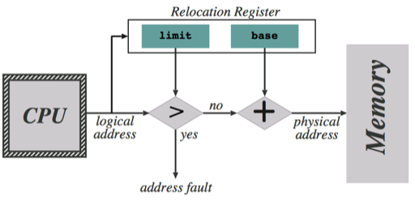
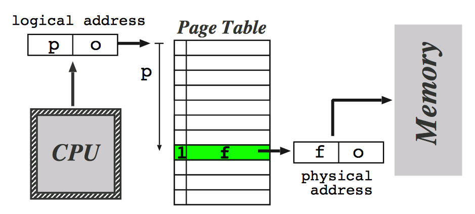
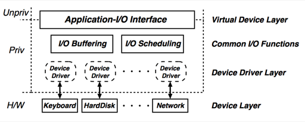

# History of computers

TL;DR

# Computer Architecture

## The Von Neumann Architecture

## Levels of programming languages

 1. Executable File ("Machine code")
 2. Object File linked with other Object Files ("Libraries") into 1.
 3. ASM Source which is assembled into 2.
 4. C/C++ Source code which is compiled into 3.
 5. ML/Java Byte-code which is interpreted

This is analogous to operation of the computer.

## Layered Virtual Machines

Think of a virtual machine in each layer built on the lower VM; machine in one level understands language of that level

 0. Digital Logic Level
 1. __Conventional Machine Level__
 2. __Operating System Level__
 3. Assembly Language Level
 4. Compiled Language Level
 5. Meta-Language Level

## Registers

 - Very fast on-chip memory
 - Typically 32 or 64 bits
 - 8 to 128 registers is usual
 - Data is loaded onto registers before being operated on
 - Registers may not be visible to the programmer
 - Most processors have _data_ and _control_ (special meaning to CPU) registers

## Memory Hierarchy

 1. CPU
 2. Cache
     i. fast, expensive
     ii. several levels of cache
 3. Main Memory
 4. DISK I/O
     i. I/O devices usually connected via a bus
     ii. very slow and cheap

## Fetch-Execute Cycle

PC initialised to fixed value on CPU reset. Then repeat until halt:

 1. instruction _fetched_ from memory address in PC into instruction buffer
 2. Control Unit _decodes_ the instruction
 3. Execution Unit _executes_ the instruction
 4. PC is updated either explicitly by a jump or implicitly

## Buses

A bus is a group of 'wires' shared by several devices. Buses are cheap and versatile but can become a bottleneck on performance. A bus typically has:

 - address lines
 - data lines
 - control lines

A bus is operated in a master-slave protocol: e.g. to read data from memory, CPU puts address on a bus and asserts 'read'; memory retrieves data, puts data on bus; PC reads from bus. In some cases an initialisation protocol is needed to decide which device is the bus master.

### Bus Hierarchy

## Interrupts

There are devices much slower than the CPU. We can't have CPU wait for these devices. Also, external events may occur.

Interrupts provide a suitable mechanism. Interrupt is a signal line into CPU. When asserted, CPU jumps to a particular location (e.g. on x86 on interrupt the CPU jumps to address stored in relevant entry of table pointed to by IDTR control register). The jump saves state; when the interrupt handler finishes, it uses a special return instruction to restore control to original program.

## Direct Memory Access

DMA means allowing devices to write directly (via a bus) into main memory, e.g. CPU tells device 'write next block of data into address x' and gets an interrupt when done.

PCs have a basic DMA; IBM main-frames have I/O channels which are a sophisticated extension to DMA.

# Operating System function

 - handles relations between CPU, memory and devices
 - handles allocation of memory
 - handles sharing of memory and CPU between different logical tasks
 - handles file management
 - (in Windows) handles the UI graphics

__Kernel__ - single (logical) program that is loaded at boot time and has primary control of the computer

## Early batch systems

In the beginning, OS simply transferred programs from punch cards into memory. Operator had to set up entire job, programmatically.

_Monitor_ is a simple resident OS that reads jobs, transfers control to programs, receives control. Monitor is permanently resident, programs must be loaded into a different area of the memory.

Batches of jobs can be put onto one tape and read in turn by the monitor - reduces human intervention.

Protecting the monitor from the users, which should not be able to:

 - __memory protection__: write to monitor memory
 - __timer control__: run forever
 - __privileged instructions__: directly access I/O or certain other machine functions
 - __interrupts__: delay the monitor's response to external events

## Multiprogramming

Jobs would waste 75% CPU cycles waiting on I/O. _Multiprogramming_ was introduced to tackle this. Monitor loaded several user programs when one is waiting for I/O, run another.

Multiprogramming, means the monitor must:

 - manage memory among the various tasks
 - schedule execution of the tasks

### Time-sharing

Allow interactive access to computer with many users sharing. Early system gave each user 0.2s of CPU time; then save state and load state of next scheduled user.

### Virtual Memory

Multitasking and time sharing are much easier if all tasks are resident rather than being swapped in and out of memory.

__Virtual memory__ - decouples memory as seen by the user task from physical memory. Task sees virtual memory which may be anywhere in real memory or paged out to a disk.

### The Process Concept

With virtual memory, it becomes natural to give different tasks their own independent _address space_ or view of memory. Monitor then schedules _processes_ appropriately and does all the _context-switching_ transparently to user process.

### Modes of CPU operation

To protect OS from users, all modern CPUs operate in more than one _privilege level_:

 - IBM has __supervisor__ and __problem__ states
 - x86 has rings 0, 1, 2, 3

Transitions to higher privilege levels are only possible through tightly controlled mechanisms. IBM __SVC__ or Intel __INT__ are like software interrupts that change to supervisor mode and jump to pre-determined address.

### Memory Protection

Virtual memory allows user's memory to be isolated from kernel memory and other users' memory:

 - A frame or page may be read or write accessible only to a processor in high privilege level
 - In S/370 each frame of memory has a 4-bit storage key and each task runs with a particular key
 - The virtual memory mechanism can be extended with permission bits; frames can then be shared
 - Combination of all of the above may be used

## OS Structure 

- __Traditional (Monolithic)__ 
    + All OS functions sit in the kernel a single function can crash the whole system
- __Micro-kernel__
    + Small core which talks to (maybe privileged) components in separate servers
    + Increase modularity
    + Increase extensibility
    + More overhead
    + Difficult to implement
    + Keep multiple copies of OS data structures

Modern OSes are hybrid:
 - Linux is monolithic but has (un)loadable modules
 - Windows started micro-kernel but for performance changed

# Processes

__Process is a program in execution.__ It may have own view of memory, sees one processor although it's sharing it with other processes - __virtual processor__. To switch between processes we need to track:

 - its memory, including stack and heap
 - contents of registers
 - PC
 - state

## Process States

 - __New__: process being created
 - __Running__: process being executed on CPU
 - __Ready__: not on CPU but ready to be
 - __Blocked__: waiting for an event (I/O)
 - __Exit__: process finished, awaiting clean-up

<!--  -->

 - __admit__: process control set up, move to run queue
 - __dispatch__: scheduler gives CPU to runnable process
 - __time-out/yield__: running process forced to/volunteers to give up CPU
 - __event-wait__: waiting for an event (I/O)
 - __event__: event occurs - wake up process and tell it
 - __release__: process terminates, release resources

### Process Control Block (PCB)

 - unique process ID
 - process state
 - PC and other registers
 - memory management
 - scheduling and memory management info
 - list of open files, name of executable, owner, CPU time used so far, devices

## Kernel Context

Kernel executes:

 - __Older OSes__: single program in real memory
 - __Modern OSes__: may execute in context of a user process, parts of OSes may be processes (e.g. I/O in Unix and IBM)

## Creating Processes

 - By the OS when a job is submitted or a user logs on
 - By the OS to perform background service for a user (e.g. printing)
 - By explicit request from user program

When a process is created, OS must:

 - assign unique identifier
 - allocate memory space, kernel and user memory
 - initialise PCB and memory management tables
 - link PCB into OS data structures
 - initialise remaining control structures
 - WinNT, IBM: load program
 - Unix: make child process copy of parent (on write)

## Ending Processes

 - Terminate voluntarily (e.g. exit())
 - Perform illegal operation
 - Be killed by user (e.g. kill()) or OS
     + allocated resources exceeded
     + task functionality no longer needed
     + parent terminating

On termination, OS must:

 - deal with pending output, etc.
 - release all system resources held by the process
 - unlink PCB from OS data structures
 - reclaim all user and kernel memory

## Threads

Processes

 - own resources such as address space, I/O devices and files
 - are units of scheduling and execution

Threads, however, are allowed to be executed concurrently in one process. Everything said about scheduling applies to threads as well but process-level context is shared by thread contexts.

 - creating threads is quick (cca. 10 times faster than process)
 - ending threads is quick
 - switching threads within process is quick
 - inter-thread communication is quick and easy (shared memory)

### Thread operations

 - __create__: thread spawns a new thread, specifying instruction pointer or routine to call, OS sets up everything
 - __block__: thread waits for event - other threads may execute
 - __unblock__: event occurs, thread becomes ready
 - __finish__: thread completes, context reclaimed

### Thread libraries

- thread library implements mini-process scheduler (in user space)
- context of thread is PC, registers, stacks, etc. (in user space)
- thread control block (in user process's memory)
- switching between threads voluntary or on time-out

__Advantages__

 - context-switching is fast (no OS)
 - scheduling can be tailored to the application
 - library can be OS-independent

__Disadvantages__

 - if thread makes blocking system call, entire process is blocked (there are ways around this)
 - user-space threads don't execute concurrently on multi-processor systems
 
# Multi-processing

Several processors used together

 - __Single Instruction Single Data Stream (SISD)__: normal set-up, one processor, one instruction stream, one memory
 - __Single Instruction Multiple Data Stream (SIMD)__: a single program executes in lock-step on several processors (large scientific apps)
 - __Multiple Instruction Single Data Stream (MISD)__: not used
 - __Multiple Instruction Multiple Data Stream (MIMD)__: many processors each execution different programs on different data

Within MIMD, processors could be _loosely coupled_ (e.g. network of PCs with communication links) or _tightly coupled_ (e.g. processors connected via a single bus).

## Symmetric Multi-processing (SMP)

Where does the OS run when multiple processors?

 - __master-slave__: kernel runs on one CPU, and dispatches processes to others. All I/O is done by request on kernel CPU. Easy but inefficient and failure prone.
 - __symmetric__: the kernel executes on any CPU. Kernel may be multi-process or multi-threaded. Each processor may have its own scheduler. More flexible and efficient - more complex.

### SMP OS design considerations

 - __cache coherence__: several CPUs, one shared memory. Each CPU has its own cache. Usually solved by hardware designers.
 - __re-entrancy__: several CPUs may call kernel simultaneously. Kernel code must be written to handle this.
 - __scheduling__: genuine concurrency between threads and kernel threads.
 - __memory__: must maintain virtual memory consistency between processors.
 - __fault tolerance__: single CPU failure should not influence others.

## Scheduling

Happens over several time-scales and at several levels:

 - __batch scheduling (long-term)__: which jobs should be started
 - __medium-term__: some OSes _suspend_ or _swap out_ processes to ameliorate resource contention
 - __process scheduling (short-term)__: which process gets CPU next, how long

### Criteria for scheduling

 - __good utilisation__: minimise amount of CPU idle time and job throughput
 - __fairness__: all jobs should get a 'fair' share of the CPU
 - __priority__: high-priority jobs get larger share
 - __response time__: fast response to interactive input
 - __real-time__: hard deadlines, e.g. chemical plant control
 - __predictability__: avoid wild variations in user-visible performance

Balance is dependent on the system. On a PC, response time is important. On a main-frame throughput is important.

### Non-pre-emptive Policies

Once a job gets CPU it keeps it until it yields it or needs e.g. I/O. Suitable for long-term policies, not used for short-term.

 - __first-come-first-served (FCFS)__: Favours long and CPU-bound processes over short or I/O bound processes. Used as sub-component of priority systems.
 - __shortest-process-next (SPN)__: Dispatch process with shortest expected processing time. Improves overall performance time. Favours short jobs and has poor predictability. To estimate expected time - user can estimate (long-term), build up CPU residency over time (short-term)

### Pre-emptive Policies

Processes could be interrupted after some time - __quantum__.

 - __round-robin__: When quantum expires, running process sent to the back of the queue. Favours CPU-bound processes - can be refined to avoid. Quantum should be slightly greater than average interaction time (Unix - 50 ms).
 - __shortest-remaining-time (SRT)__: Pre-emptive version of SPN. On quantum expiry, dispatch process with shortest expected running time. Tends to starve long CPU-bound processes.
 - __feedback__: use dynamically assigned priorities.
     + New process starts in queue with priority 0 (highest).
     + Each time it is pre-empted, goes back to next lower priority queue.
     + Dispatch first process in highest occupied queue.
     + Tends to starve long jobs, possible solutions:
         * Increase quantum for lower priority processes
         * Raise priority for processes that are starved

### Multi-processor Scheduling

 - Assigning processes to processors
     + static assignment - may have idle CPUs
     + dynamic assignment - complexity increased
 - Deciding on multi-programming on each CPU
     + If many CPUs and app parallel at thread-level then maybe don't.
 - Dispatching processes

### SMP Scheduling

For _process scheduling_, performance analysis and simulation indicate that the differences between scheduling algorithms are reduced in SMP - no need to use complex systems, FCFS or a variant may suffice. However, FCFS has disadvantages:

 - single pool of TCBs (like PCB for threads) must be accessed with mutual exclusion - may be a bottleneck
 - pre-empted threads are unlikely to be re-scheduled to the same CPU - loses benefit of a CPU cache
 - unlikely for program to get its threads running at the same time, opposite could impact performance

For _thread scheduling_, situation more complex - unlike processes, threads often interact. Main approaches are:

 - __load sharing__: idle processors selects ready thread from whole pool
     + simplest and most like uni-processing environment
 - __gang scheduling__: a gang of related threads are simultaneously dispatched to a set of CPUs
 - __dedicated CPUs__: static assignments of threads to CPUs
 - __dynamic scheduling__: involve the application in changing number of thread; OS shares CPUs among apps 'fairly'

Most systems use load sharing (with tweaks), some scientific systems use gang scheduling.

### Real-Time Scheduling

Real-time systems have deadlines. Theses may be _hard_ (necessary for success of a task) or _soft_ (if not met, still worth running the task).

Requirements for RT systems:

 - __determinism__: need to acknowledge events within pre-determined time
 - __responsiveness__: take appropriate action quickly enough
 - __user control__: hardness of deadlines and priorities is a matter for user
 - __reliability__: systems must fail softly, no panicking, ideally no fails

# Concurrency

Control access to a shared variable: protect each read-write sequence by a _lock_ which ensures _mutual exclusion_.

## Mutual Exclusion

Allow process to identify _critical sections_ where they have exclusive access to a resource.

### Requirements

 - mutual exclusion must be enforced
 - processes blocking in non-critical section must not interfere with others
 - processes wishing to enter critical section must eventually be allowed to do so
 - entry to critical section should not be delayed without a cause
 - there can be no assumptions about speed or number of processors

### Implementation

 - __via hardware__: special machine instructions
 - __via OS support__: OS provides primitives to call
 - __via software__: entirely by user code

We assume that mutual exclusion exists in hardware, memory access is atomic - only one write/read at a time.

__Dead lock__ - both processes loop forever waiting for the other to finish.

__Live lock__ - both processes run in exact synchrony and keep deferring to each other.

### Mutex - Dekker's algorithm

Ensure that one process has priority, so will not defer and give other process priority after performing own critical section.

~~~c
/* using j instead of i hat */
flag[i] = true;
while (flag[j]) {
    if (turn == j) {
        flag[i] = false;
        while (turn == j) {}
        flag[i] = true;
    }
}
/* critical section */
turn = j;
flag[i] = false;
~~~

### Mutex - Peterson's algorithm

Peterson found a more simple and elegant algorithm.

~~~c
/* using j instead of i hat */
flag[i] = true;
turn = j;
while (flag[j] && turn == j) {}
/* critical section */
flag[i] = false;
~~~

### Mutex - Using hardware support

 - Uniprocessor: mutex achieved by disabling processes from being interrupted. Used extensively in many OSes. Forbidden to user programs.
 - SMP systems: special instruction, e.g. IBM has `TEST AND SET` which reads a bit of memory and then sets it to 1, atomically. Easy mutex, have a variable `token` and process grabs `token` using test-and-set:

    ~~~c
    while (test-and-set(token) == 1) {}
    /* critical section */
    token = 0;
    ~~~
   
    This is still busy-waiting, deadlock is possible and if low priority grabs the token, high priority pre-empts and can wait forever.

## Semaphores

A semaphore is a special (integer) variable which can be accessed only by the following operations:

 - `init(s, n)`: create semaphore and initialise it to non-negative value `n`
 - `wait(s)`: semaphore value decremented; if value negative calling process is blocked
 - `signal(s)`: semaphore is incremented; if value non-positive one process blocked on `wait` is unblocked.

Traditionally, `P` and `V` are used for `wait` and `signal`.

Semaphore could be:

 - __strong__: waiting process are released FIFO; more useful, generally provided
 - __weak__: no guarantee about the order; not used here

__Binary semaphore__ - takes on values 0 and 1. `wait` decrements 1 to 0 or blocks if 0 already. `signal` unblocks, or increments from 0 to 1 if no blocked processes.

### Advantage of semaphores

The mutex problem is confined inside just two system calls. User programs do not need to busy-wait; only the OS busy-waits (for a short time).

### Using semaphores

~~~c
wait(s);
/* critical section */
signal(s);
~~~

When semaphore is initialised to `m` instead of `1` then `m` processes run at the same time.

### The Producer-Consumer problem

A _producer_ repeatedly puts items into a buffer and a _consumer_ takes them out. The problem is to make this work without delaying either party. Solution using two semaphores `init(n, 0)` (tracks number of items in buffer) and `init(s, 1)` (used to lock the buffer):

__Producer loop__

~~~c
datum = produce();
wait(s); // wait until can add to buffer
/* critical section */
append(buffer, datum);
signal(s); // done with buffer
signal(n); // added another item to be consumed
~~~

__Consumer loop__

~~~c
wait(n); // wait for items in buffer
wait(s); // wait until can extract from buffer
/* critical section */
datum = extract(buffer);
signal(s); // done with buffer
consume(datum);
~~~

## Monitor

Semaphores have `wait` and `signal` separated in code - hard to understand. A _monitor_ is an object which provides some methods (protected by mutex) so only one process can be 'in the monitor' at a time. Monitor variables are only accessible from monitor methods.

 - `cwait(c)`: where `c` is a _condition variable_ confined to monitor; process is suspended and the monitor released for another process.
 - `csignal(c)`: some process suspended on `c` is released and takes the monitor.

Unlike semaphores, `csignal` does nothing if no process is waiting.

### Advantage of monitors

Monitors enforce mutex and all the synchronisation is inside the monitor methods where it's easier to find and check.

### The Readers/Writers Problem

Resource which can be read by many processes at one but any read must block a write. It can be written by only one process at once, blocking everything else. Can be solved using semaphores. Who has priority?

 - Unix file locks
 - OS/390 ENQ syscall provides general purpose read/write locks
 - Linux kernel uses read/write semaphores internally

## Message Passing

Many systems provide message passing services. Processes may `send` and `receive` messages from each other. `send` and `receive` may be blocking or non-blocking when there is no receiver waiting or no message to receive. Most usual is non-blocking `send` and blocking `receive`.

Can be used for mutex and synchronisation:

 - simple mutex by using a single message as a _token_
 - producer/consumer: producer sends data as messages to consumer; consumer sends null messages to acknowledge them

## Deadlock

Permanent blocking of two or more processes in a situation where each holds a resource the other needs but will not release it until after obtaining the other's resource.

Process P

~~~c
acquire(A);
acquire(B);
release(A);
release(B);
~~~

Process Q

~~~c
acquire(B);
acquire(A);
release(B);
release(A);
~~~

Another instance is when two processes are each waiting for the other to send a message.

### Preventing a deadlock

3 facts need to be true for deadlock to happen

 - resources are held by only one process at a time
 - a resource can be held while waiting for another
 - processes do not unwillingly lose resources

If any of these does not hold, deadlock does not happen. If they are true, deadlock may happen if

 - a circular dependency arises between resource requests

The first three can be prevented from holding but not practically. The fourth can be prevented by ordering resources and requiring processes to acquire resources in increasing order.

### Avoiding a deadlock

A more refined approach is to deny resource requests that might lead to a deadlock. This requires processes to declare in advance the maximum resource they might need. Then, when a process requests a resource, _analyse_ whether granting the request might result in a deadlock.

The analysis is done as follows: if we grant the request, is there sufficient resource to allow one process to run to completion? And when it finishes can we run another? And so on.. If not, we should deny the request.

### Deadlock detection

There are techniques to detect whether a deadlock exists. Then we can:

 - kill all deadlocked processes
 - selectively kill deadlocked processes
 - forcibly remove resources from some processes
 - if checkpoint-restart is available, roll back to pre-deadlock point and hope it doesn't happen again

# Memory Management

Each process needs memory for

 - __code__: program itself
 - __static data__: compiled into program
 - __dynamic data__: stack, heap

Key requirements

 - __relocation__: moving programs in memory
 - __allocation__: assigning memory for processes
 - __protection__: preventing access to other processes' memory
 - __sharing__: prevent, except for where appropriate
 - __logical organisation__: how memory is seen by process
 - __physical organisation__: how memory is arranged in HW

__Relocation problem__

When we load contents of a static variable into a register where is variable in memory? When branch, where branch?

Compiler can tag all memory references and make them relative to start of program. Then _relocating header_ loads program at location `X` and adds `X` to all memory addresses in the program. Expensive and what if program swapped out and brought in elsewhere.

We could provide hardware instructions that access memory relative to a _base register_ and have programmer use these. Program then sets base register but nothing else. E.g. in S/390 a typical instruction is:

~~~
L R13, 568(R12)
~~~

which loads register 13 with value in address contained in register 12 offset by 568. This could be done by hardware and OS instead of the programmer.

## Segmentation

A segment is a portion of memory starting at an address given in a _base register_ `B`. The OS loads a value `b` into `B`. When the program refers to a memory address `x`, hardware transparently translates it into `x + b`.

To achieve protection, we can add _limit register_ `L`. OS loads `L` with length of segment `l`. If `x > l` then raise _address fault_ (exception SEGFAULT).

### Partitioning

Segmentation allows programs to be put into any available chunk of memory. How do we partition memory between various processes?

 - __fixed partitioning__: divide memory into fixed chunks. Disadvantage: small process in large chunk is wasteful
 - __dynamic partitioning__: load process into a suitable chunk; when exits, free chunk and merge with neighbouring free chunks. Disadvantage: _(external) fragmentation_ - memory tends to get split into small chunks. May need to _swap out_ running process to make room for higher priority new process. How do we choose chunks?
     + first fit: choose first big enough chunk (generally best)
     + next fit: choose first big enough chunk after last allocated chunk (fragments more)
     + best fit: choose chunk with least waste (fragments a lot)

### Partitioning - The Buddy System

Compromise between static and dynamic.

 - Memory is maintained as a binary tree of blocks of size $2^k$ for $L \leq k \leq U$ suitable lower and upper bounds
 - When process of size $s$, $2^{i-1} < s \leq 2^i$ comes in, look for free block of size $2^i$. If none, find (recursively) block of size $2^{i+1}$ and split it in two.
 - When blocks are freed, merge free sibling nodes ("buddies") to re-create bigger blocks.

Variants on the buddy system are still used, e.g. in allocating memory within the Linux kernel.

### Multiple Segments

We can extend segmentation to have multiple segments for a program:

 - hardware/OS provide different segments for different types of data e.g. code, static data and dynamic data.
 - hardware/OS provides multiple segments at user request
     + logical memory address viewed as a pair `(s, o)`
     + process has _segment table_: look up entry `s` in table to get base and limit by b and l
     + translate as normal to `o + b` or raise fault if `o + b > l`

### Advantages of Segmentation

 - may correspond to user view of memory
 - protection can be done per segment, each segment can be protected agains, e.g. read, write, execute
 - sharing of code/data easy but it is better to have a single list of segment descriptors and have process segment tables point into that than to duplicate info between processes

### Disadvantages of Segmentation

 - variable size segments lead to external fragmentation, again
 - may need to _compact_ memory due to fragmentation
 - small segments tend to minimise fragmentation but annoy the programmer

## Paging

Small segments reduce fragmentation; variable size segments introduce problems.

__Paging__ - have many small fixed-size segments always provided (invisibly) to the programmer.

Virtual storage is divided in _pages_ of fixed size (typically 4KB). Each _page_ is mapped to a _frame_ of real storage by means of a _page table_.

 - __Page__: virtual memory unit
 - __Frame__: real memory unit
 - __Page table__: translates pages to frames
     + includes _valid bit_ since not all pages may have frames
     + start and length of a page table are held in control registers like in segmentation
     + may include _protection bit(s)_ in page table entry for read, write, execute

### Translation Lookaside Buffer (TLB)

With paging (or segmentation) each logical memory reference needs two physical memory references. A TLB is a special associative cache for keeping recently used paging information - it maps pages into frames, bypassing the page table. Like all caches, TLB has coherency problem:

 - when process context-switches, active page table changes must flush TLB
 - when page is freed must invalidate entry in TLB
 - changes in protection bits must also invalidate TLB entry

### Multi-level Paging

Modern systems have address space of at least $2^31$ bytes or $2^19$ 4K pages. Modern systems have two or more levels of page table 

### Sharing Pages

Memory can be shared by having different pages map to the same frame. For code we need re-entrant code (not self-modifying). Otherwise, use copy on write:

 - mark the pages as read-only in each process (using protection bits)
 - when process writes, generate protection exception
 - OS handles exception by allocating new frame, copying shared frame, and updating process's page table

### Virtual Memory

Pages don't have to be in real memory all the time. Store them on disk when not needed!

 - initialise process's page table with invalid entries
 - on first reference to page, get exception: handle it, allocate frame, update page table entry
 - when real memory gets tight, choose some pages, write them to disk, invalidate them and free frames for use elsewhere
 - when process refers to page on disk, get exception: handle by reading from disk (if necessary paging out some other page)

OSes often use frame-address portion of invalid page table entry to keep its location on disk.

Hardware support for VM usually include:

 - __modified bit__: no need to write out page if not changed since last read in
 - __reference bit or counter__: unreferenced pages are candidates for freeing

Architectures differ on where this happens:

 - __Intel__: modified and reference bits are part of page table entry
 - __S/390__: they are part of storage key associated with each real frame

### Combined Paging and Segmentation

 - S/390
     + Intertwined, can be seen as 2-level paging system
     + Logical address is 31 bits
     + First 11 bits index into current segment table
     + Next 8 bits index into page table
     + Remaining bits are offset

    Page tables can be paged out, by marking their entries invalid in the segment table (one segment table per process).

 - Intel
     + Full-blown segmentation and independent paging
     + Logical address is 16-bit segment id and 32-bit offset
     + Segment id portion of logical address is found via a segment register which is usually implicit in access type (`CS` for instruction, `DS` for data, `SS` for stack, `ES` for string data) but can be specified to be in any of six segment registers
     + Segment registers are part of task context
     + There may be single global segment table but also task-specific tables

    The result of segment translation is 32-bit linear address which completely independently goes through a 2-level paging system.

    + Segment related info (e.g. segment tables) can be paged out; so can 2nd-level page tables
    + There is no link between pages and segments: segments don't need to lie on page boundaries
    + Pages can be 4KB or 4MB
    + Page table register is part of task context, stored in task segment.

### Paging Policies

In a virtual memory system, OS needs to decide what to page in and out

 - __minimise the number of page faults__: avoid paging out pages that will be needed
 - __minimise disk I/O__: avoid _reclaiming_ dirty pages

__Fetch Policies__

When should a page be brought into main memory from disk?

 - __demand paging__: when referenced - locality principle suggests this should work well after an initial burst of activity
 - __pre-paging__: try to bring in pages ahead of demand, exploiting characteristics of disk to improve efficiency
     + not shown to be effective
     + used little, if at all
     + few years ago it became a live issue again with a study suggesting it could be useful now

__Replacement Policy__

When memory runs out and a page is brought in, who do we throw out? Aim: page out the page with the longest time until next reference.

- LRU: choose the page with the longest time since last reference. This is almost optimal - high overhead.
- FIFO: simple but pages out heavily-used pages
- clock policy: attempts to get some of the performance of LRU without the overhead
     + Makes use of the _accessed bit_
     + Put frames in a circular list 0, ..., `n` - 1 with index `i`
     + When looking for a page replace, do

        ~~~
        increment i;
        while (frame i used) {
            clear use bit on frame i;
            increment i;
        }
        return i;
        ~~~

     + Doesn't choose a page unless it has been unreferenced for one complete pass through storage. Performs reasonably well, 25% worse than LRU.
     + Enhancement to reduce I/O: scan only unmodified frames, without clearing use bit. If this fails, scan modified frames, clearing use bit. If this fails, start from beginning.

### Page Caching

Many OSes use the clock policy with caches and buffers:

 - When a page is replaced, it's added to the end of the _free page list_ if clear, or the `modified page list` if dirty.
 - The actual frame used for the paged-in page is the head of the free page list.
 - If no free pages, or when modified list gets beyond certain size, write out modified pages and move to free list.

This means that:

 - pages in the cache can be instantly restored if referenced again
 - I/O is batched and therefore more efficient

Linux allows you to tune various parameters of the paging caches. It also has a background kernel thread that handles actual I/O this 'trickles out' pages to keep a certain amount of memory free most of the time, to make allocation fast.

### Resident Set Management

In the previous schemes, when a process _page faults_, some other process's page may be thrown out. Alternatively, we could have a _resident set_ for each process.

 - allocate a certain number of frames to each process
 - after a process reaches its allocation, if a page faults, choose some page of that process to reclaim
 - re-evaluate resident set size (RSS) from time to time

__How to choose RSS__

The working set of a process over time $\Delta$ is the set of pages referenced in the last $\Delta$ time units. aim to keep the working set in memory. Working sets tend to be stable for some time (locality) and change to a new stable set every so often (inter-locality transitions).

Actually tracking the working set is expensive. Some approximations:

 - __page fault frequency__: choose threshold frequency `f`. On page fault:
     + if virtual time since last fault is < 1/`f`, add one page to RSS
     + otherwise, discard unreferenced pages and shrink RSS; clear use bits on other pages
     + works quite well but poor performance in inter-locality transitions
 - __variable-interval sampled working set__: at intervals,
     + evaluate working set (clear use bits at start, check at end)
     + make this the initial resident set for next interval
     + add any faulted-in pages (shrink RSS between intervals)
     + the interval is every `Q` page faults subject to lower and upper time bounds `L` and `U`
     + Tune `Q`, `L` and `U` according to experience

# Input/Output

- dealing with wildly disparate hardware
- speeds ranging from $10^2$ to $10^9$ bps
- applications from human communication to storage
- varying complexity of device interface (e.g. line printer vs. disk)
- data transfer sizes from 1 byte to megabytes
- in many representations and encodings
- giving many idiosyncratic error conditions

## I/O Techniques

 - __direct control__: CPU controls device by reading/writing data directly
 - __polled I/O__: CPU communicates with hardware via built-in controller
 - __interrupt-driven I/O__: CPU commands device, gets interrupt on completion
 - __direct memory access (DMA)__: CPU commands device, which transfers data directly to/from memory (DMA controller separate or on chip)
 - __I/O channels__: device has specialised processor, interpreting special command set; CPU asks device to execute entire I/O program

### Programmed/Polled I/O

Device has registers accessible via system bus. For output:

 - CPU places data in data register
 - CPU puts write command in command register
 - CPU busy-waits reading status register until ready flag is set

Input is the same, except it reads data from a register.

### Interrupt-driven I/O

Interrupt handler is usually split into a device-independent prologue (sometimes called 'interrupt handler') and a device-dependent body (sometimes called 'interrupt service routine'). Prologue saves context, does interrupt de-muxing. Body does device-specific work, e.g. acknowledge interrupt, read data, move it to user space. Body needs to run fast (so next interrupt can be handled) but may need to do complex work - therefore often schedule non-urgent part to run later.

### DMA

A DMA controller accesses memory via a system bus and devices via I/O bus. To use system bus, it _steals cycles_: takes mastery of the bus for a cycle, causing CPU to pause.

CPU communicates (as bus master) with DMA controller via usual bus technique: puts address of memory to be read/written on data lines, address of I/O device on address lines read/write on command lines.

DMA controller then handles transfer between memory and device; interrupts CPU when finished.

Note: DMA interacts with paging! Can't page out a page involved in DMA. Solution: either lock page into memory or copy to buffer in kernel memory and use that instead.

### I/O Channels

IBM mainframe peripherals have sophisticated controllers called 'channels'.

OS builds _channel program_ in main memory and issues `START SUBCHANNEL` instruction. Channel executes entire program before interrupting CPU.

Channels and devices are themselves organised into a complex communication network to achieve maximum performance. IBM mainframe disk drives are more sophisticated than PC disks.

## Taming I/O programming

Confine device-specific code to small, low-layer and write high-level code in terms of abstract device classes.

Many OSes classify devices into broad classes:

 - __character__: terminals, printers, keyboards, mice (transfer data byte at a time, no storage)
 - __block__: disk, cd-rom, tape (transfer data in blocks, yes storage)
 - __network__: ethernet, etc. (mixed characteristics and idiosyncratic control)
 - __other__: clocks etc.

Unix has a 'everything is a file' philosophy: devices appear as special files. If read/write makes sense, you can do it; device-specific functions available via `ioctl` system call on device file. Somebody still has to write the driver!

## Disk Basics - do you even SSD?

Disks are the main storage medium and their physical characteristics give rise to special considerations.

 - a typical modern disk drive comprises several _platters_, each a thin disk coated with magnetic material
 - A comb of _heads_ is on a movable arm, with one head per surface
 - If the heads stay still, they access circles on the spinning platters. One circle is called a _track_; a set of tracks is called a _cylinder_
 - Often tracks are divided into fixed length _sectors_

To access data in a given sector:

 - move head assembly to the right cylinder (4 ms)
 - wait for right sector to rotate beneath head (5 ms)

### Disk scheduling

Art of minimising the delays. If I/O requests are handled as they arrive much time is wasted in seek and rotation delays. Because of locality LIFO works quite well; more intelligent scheduling:

 - __shortest-service-time-first (SSTF)__: do request with shortest seek time
 - __SCAN__: move the head assembly from out to in and back again, servicing requests for each cylinder as it's reached. Avoids starvation; is harmed by locality.
 - __C-SCAN__: scan in one direction only, then flip back. Avoids bias towards extreme tracks.
 - __FSCAN, N-step-SCAN__: avoid long delays by servicing only a quota of requests per cylinder (N-step-SCAN) or only those requests arrived before start of current scan (FSCAN).

### RAID

Disks are slow and store critical information. RAID (redundant array of independent disks) is a suite of techniques for improving failure resistance and performance. Basic idea: view several disks as one logical volume.

Levels of RAID

 - __Level 0__: data are striped across n disks. Data is divided into strips; first n logical strips placed in first physical strip of each disk. Thus, n consecutive logical strips can be read in parallel. Choice of strip size depends on application
     + high transfer rate (small strips -> high parallelism within one request)
     + high I/O request rate (large strips -> several different requests in parallel)
 - __Level 1__: data are mirrored (duplicated) on each disk. Protects against disk failure; no overhead, instant recovery
 - __Level 2__: data are striped in small (byte or word) strips across some disks, with an error checksum (Hamming code) striped across other disks. Overkill - not used.
 - __Level 3__: same as level 2 but using only parity bits (for error checking) stored on other disk. If one disk fails, data can be read with on-the-fly parity computation; then failed disk can be regenerated. Has write overhead
 - __Level 4__: large data strips, as for level 0, with extra parity strip on other disk. Write overhead again, bottleneck on parity disk.
 - __Level 5__: as level 4 but distribute parity strip across disks, avoiding bottleneck
 - __Level 6__: data striping across n disks, with two different checksums on two other disks (usually one simple parity check, one sophisticated checksum). Designed for every high reliability.

# File Organisation

Unix thinks of a file as an unstructured stream of bytes. Not universally the case. Structural hierarchy often provided at OS level:

 - __field__: basic element of data. May be typed (string, integer etc.). May be of fixed or variable length. Field name may be explicit or implicit in position in record.
 - __record__: collection of related fields, relating to one entity. May be of fixed or variable length and have fixed or variable fields.
 - __file__: collection of records forming a single object at OS and user level. Usually has a name and is entered in directories or catalogues. Usual unit of access control.
 - __database__: collection of related data, often in multiple files, satisfying certain design properties. Usually not at OS level.

## Layers of Access to File Data

As usual, access is split into conceptual layers:

 - device drivers
 - __physical I/O__: reading/writing blocks on disk
 - __basic I/O system__: connects file-oriented I/O to physical I/O. Scheduling, buffering etc.
 - __logical I/O__: presents the application programmer with a uniform view of files and records
 - __access methods__: provide application programmer with routines for indexed access etc.

## File Organisation

How are records structured within a file? May be application concern only (Unix) or built-in to OS (IBM).

 - __byte stream__: unstructured stream of bytes (only Unix type)
 - __pile__: unstructured sequence of variable length records. Records and fields need to be self-identifying; can be searched only exhaustively.
 - __fixed sequential__: sequence of fixed-length records. Can store only value of fields. One field may be _key_. Search is sequential; if records ordered by key, need not be exhaustive (problems in update).
 - __indexed sequential__: add an _index file_ which indexes key fields position in main file and _overflow file_ for updates. Access much faster; update handled by adding to overflow file. Every so often merge overflow with main file.
 - __indexed__: drop the sequential ordering; use one exhaustive index plus auxiliary indices
 - __hashed/direct__: hash key value directly into offset within file. Again use overflow file for updates.

## Directories and Catalogues

How is a file found on disk? OSes often have hierarchical directories:

 - directories list files, including other directories
 - file is located by path through directory tree
 - directory entry may contain file meta-data (owner, permissions, access/modification time)
 - directories can only be accessed via system calls, not by normal I/O user routines

### Unix Files and Directories

 - files are unstructured byte sequences
 - meta-data (including pointers to data) is stored in an _inode_
 - directories link names to inodes
 - file permissions are entirely unrelated to directory permissions
 - inodes may be listed in multiple directories
 - inodes (and file data) are automatically freed when no directory links to it
 - _root directory_ of a file-system is found in a fixed inode (number 2 in Linux)

### OS/390 Data Set Organisation

 - files may have any of the formats mentioned before and others
 - files live on a disk volume which has a _VTOC_ (Volume Table Of Contents) giving names and some meta-data for files on the disk
 - files from many volumes can be put in catalogs
 - _file-name prefix_ can be associated with a catalog via the _master catalog_ E.g. the file `JCB.ASM.SOURCE` will be found in the `JCB` catalog
 - catalogs also contain additional meta-data (security etc.) depending on files
 - _master catalog_ is defined at system boot time from the VTOC of the system boot volume

## Access Control

Files are often shared between users. Access may be restricted:

 - knowledge of existence (e.g. seeing directory entry)
 - execute
 - read
 - write
 - write append-only
 - change access rights
 - delete

### Access Control Mechanisms

 - __pre-defined permission bits__: Unix read/write/execute for owner/group/other users
 - __access control lists__: giving specific rights to specific users or groups
 - __capabilities__: granted to users over files

## Blocking

How are the _logical records_ packed into physical blocks on a disk?

 - __fixed blocking__: pack constant number of fixed-length records into block (PC, Unix)
 - __variable, spanning__: variable-length records, packed without regard to block boundaries. Implicit or explicit pointers when spanning blocks may be needed.
 - __variable, non-spanning__: records don't span blocks; just waste space at end of block

## File Space Allocation

 - __contiguous (one after another) allocation__: makes I/O easy and quick. Fragmentation and need for compaction - may need dynamic compaction.
 - __chained allocation__: allocate blocks as and when needed and chain them together in one list per file. Easy, no fragmentation problems but file may be scattered over disk - very inefficient and direct access is slow.
 - __indexed allocation__: file has index of blocks or sequences of blocks allocated to it. E.g. file `foo` is on blocks 3, 4, 5, 78, 79, 80. Most popular method - direct access and sequential access. Avoids fragmentation and has contiguity.

---------------
__Below is non-examinable__

# Windows NT Family

- Started in 1989 with a new micro-kernel code-base
- NT3.1 released 1993: poor quality
- NT3.5 released in 1994: more or less usable
- NT4.0 released in 1996: matched 1995 look and feel; some functions (e.g. graphics) put back into kernel
- Windows 2000 (NT 5.0): adds features for distributed processing
- Windows XP: no significant OS-side changes. Terminal servers allow multiple users on one workstation.
- Windows Vista: still NT but many components re-worked. ML based paging and security focus.
- Windows 7: trying to cut down on kernel bloat. Changes to memory management and scheduling.

## NT Design Principles

 - portability: not just Intel
 - security: for commercial and military use
 - POSIX compliance: to ease transition from Unix
 - SMP support
 - extensibility
 - internationalisation and localisation
 - backwards compatibility

## Hal, Kernel, Executive, Subsystems

__Hardware Abstraction Layer (HAL)__ converts all hardware-specific details into abstract interface.

The __(micro)kernel__ handles process and thread scheduling, interrupt/exception handling, SMP synchronisation and recovery. It is object-oriented, non-pageable and non-preemptible.

The __executive__ comprises a number of modules, running in kernel mode but in thread context (Linux kernel threads).

__Subsystems__ are user-mode processes providing native NT facilities to other operating system APIs: Win32, POSIX, OS/2, Win3.1, MS-DOS.

## Processes and Threads

NT has processes that own resources, including an address space and threads that are dis-patchable units as in the general description earlier.

Process/thread services are provided by executive's _process manager_. General purpose, no built-in restrictions to parent/child relationships.

Scheduling is priority-based, processes returning from I/O get boosted and then decay each quantum (20 ms). Special hacks for GUI response.

## Memory Management

NT has paged virtual memory. Page reclamation is local to process. RSS is managed according to global demand.

The executive _virtual memory manager_ provides VM services to processes such as sharing and memory-mapped files.

In Vista, the system tries to pre-load pages that are likely to be needed again.

## Object Management

Almost everything is an object. The executive _object manager_ provides:

 - hierarchical name-space for named objects
 - access control lists
 - naming domains: mapping existing name-spaces to object name-space
 - symbolic links
 - _handles_ to objects

## I/O Management

The executive _I/O Manager_ supervises dispatching of basic I/O:

 - asynchronous request/response model: application queues a request, is signalled on completion
 - device drivers and file system drivers can be stacked
 - cache manager provides general caching services
 - network drivers include distributed system support

NT supports FAT32 as well as NT file-systems

 - NTFS volume occupies a partition, a disk or multiple disks
 - NTFS file is structured: it has attributes
 - files located via MFT (master file table)
 - NTFS is a journalling (technique to prevent corruption) system

# z/OS - OS/390 - MVS

MVS is the basic OS component of z/OS. MVS comprises of BCP (Basic Control Program) and JES2 (Job Entry Subsystem).

## MVS Design Objectives

 - performance
 - reliability
 - availability
 - compatibility

The system recovers from and reconfigures round, almost all failures, including hardware failures.

## MVS Components

 - __supervisor__: main OS functions
 - __Master Scheduler__: system start and control, communication with operator, master task in the system
 - __Job Entry Subsystem (JES2)__: entry of batch jobs, handling of output
 - __System Management Facility (SMF)__: accounting, performance analysis
 - __Resource Management Facility__: records data about system events and usage for use by SMF and others
 - __Workload Manager__: manages workload according to installation goals
 - __Time-sharing Option (TSO/E)__: provides interactive time-sharing services
 - __TCAM, VTAM, TCP/IP__: telecoms and networking
 - __Global Resource Serialization__: resource control clusters

## Supervisor

 - __Dispatcher__: main scheduler
 - __Real Storage Manager__: manages real memory, decides on page in/out determines RSS
 - __Auxiliary Storage Manager__: handles page/swap in/out
 - __Virtual Storage Manager__: address space management and virtual allocation
 - __System Resources Manager__: supervisor component of workload manager

## Job Entry Subsystem (JES2)

 - read from 'card reader' or TSO `SUBMIT` command
 - convert JCL to internal form
 - start execution
 - spool output; hold for later inspection and/or print

JES2 is basic, JES3 has more advanced features.

## Address spaces

 - __nucleus__: important control blocks, most OS routines
 - __Fixed Link Pack Area__: non-pageable shared libraries etc.
 - __private area__: includes address-space-local system data and user programs and data
 - __Common Service Area__: data shared between all tasks
 - __System Queue Area__: page tables etc.
 - __Pageable Link Pack Area__: shared libraries permanently resident in virtual memory

Note that, unlike Linux, most system data is mapped into all address spaces. Address spaces are created for each task (operator `START` command), job and TSO user.

## Recap of other aspects

 - Memory is paged on demand with a 2-level paging system
 - Task is the basic dispatchable unit. One address space may have many tasks. The service request is a small unit, dispatchable to any address space.
 - There is a general resource control mechanism `ENQ/DEQ`.
 - SMP is supported in hardware.
 - I/O is sophisticated, offloaded from CPU - fast as hell.

## Virtual Machine OS

S/390 is easy to virtualise.

 - VM provides each user with a configurable virtual S/390 machine with full access.
 - VM control program gives each user a virtual console with operator-like commands.
 - Users may start CMS (Conversational Monitor System) a single-user OS for interactive work.
 - Users may load a S/390 OS: MVS, Linux/390 or even VM (inception)
 - VM is fully paging virtual memory OS
 - IBM OSes can be adjusted to allow communication with VM _hypervisor_ so only one OS does the paging etc.

A single S/390 machine can reasonably host 10-20 thousand VMs.
